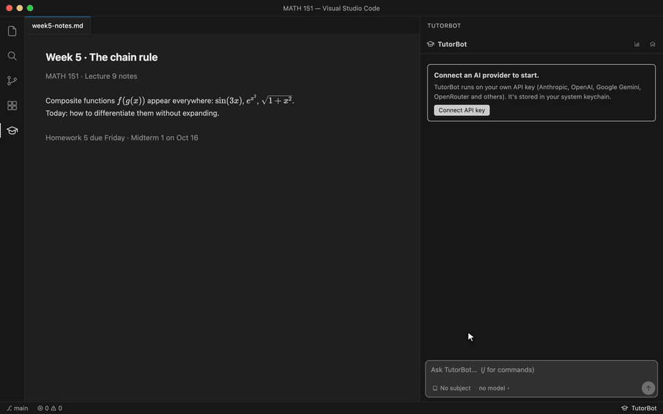

# TutorBot



A personal AI tutor that lives in VS Code. Pick a subject, point it at your class materials, and it teaches you step by step, checks what you understood with graded quizzes and coding exercises, and schedules spaced reviews so it sticks. Your progress, notes and learner profile persist across sessions.

## Getting started

1. Install the TutorBot extension (`.vsix`, see [Building](#building)).
2. Click the graduation-cap icon in the activity bar, or press ⌘Esc.
3. Click **Connect API key** and paste a key from Anthropic, OpenAI, Google Gemini, OpenRouter, DeepSeek, Mistral, Groq or xAI. It's stored in your system keychain.
4. Pick or create a subject, and optionally choose the folder with your class materials.

Nothing else to install: the extension bundles its AI engine ([pi](https://github.com/earendil-works/pi-mono), MIT) and runs it on VS Code's built-in Node.js. Optional tools TutorBot uses when present: `java` and `python3` for Java/Python exercises, and `pdftotext` (poppler) to read PDF class materials.

## What it does

- **Teaches from where you are.** Short diagnostic questions find what you already know; lessons build one idea at a time from there, in your course's notation and order.
- **Graded quizzes in the chat.** Multiple choice (with an honest "I don't know") and typed answers. Answer keys for code output and math are verified by actually running code before a question is shown.
- **Coding exercises.** TutorBot writes a small program to build, with tests. The file opens in the editor, tests re-run as you type, and compile errors show as squiggles. Submit with ⌘⌥↵, ask for a hint with ⌘⌥H.
- **Progress dashboard.** Per concept: how well you'd recall it today, and how you've proven it (with help, on your own, in a checkpoint), across the whole course map.

## Learning features (evidence-based)

- **Explain-it-back**: after a miss or a guess, you explain why before seeing TutorBot's explanation ("Just show me" is always there).
- **Hint ladder**: questions carry up to 3 graduated hints (the Hint button). Answers that needed hints don't count toward mastery.
- **No-help checkpoints**: `/checkpoint`. "Mastered" needs a passed checkpoint plus FSRS stability of at least 21 days (that is, spaced reviews).
- **Interleaved practice**: `/practice` mixes look-alike problem types, so you name the technique first.
- **Confidence**: rate each answer Guess, Fairly sure or Certain. Confident misses go to the front of review, and calibration shows on the dashboard.
- **Escape hatch**: after two misses or frustration, TutorBot switches to a direct worked example. `/stuck` does it on demand.
- **Learns how you learn**: each lesson records its teaching approach. Your results plus quick ratings (Clicked, Still fuzzy, Too fast, Too slow; or `/rate`) produce a measured ranking TutorBot follows. See "How you learn" in `Tutor/Progress.md`.
- **Class folder per subject**: the folder chip in the panel, `/folder`, or Home → subject → Choose class folder. TutorBot learns your teacher's question style (`/course-style`) and writes practice to match.
- **Progress dashboard** (VS Code: the chart button in the panel header, or *TutorBot: Open Progress*): for each concept, *memory* (today's chance of recall, from FSRS, fading between reviews) and *proof* (not tested, not yet correct, with help, on your own, checkpoint-proven), shown separately and never blended. "Not enough evidence" appears until there are 2 graded answers. It shows the whole course from a topic map (`/course-map` builds one from the class folder), so untouched topics show as gaps. Exams show topic coverage plus a ranked at-risk list, with no readiness %. Topic tags TutorBot guessed are flagged until you confirm them.
- **Nudges**: `/exams`, weekly summaries in `Tutor/Weekly/`, a VS Code notice when reviews are due, and optional daily Mac notifications (`/nudges on 18:00`).

## Commands

State lives in `Tutor/` in your TutorBot folder (`~/TutorBot` by default): `Progress.md` (dashboard), `Learner Profile.md` (how you learn, editable), `.data/` (raw data + resource index).

| Command | What it does |
|---|---|
| `/tutor-resources add <folder>` | Add a class folder to the current subject (PDF, PPTX, DOCX, MD, TEX, code…). It's indexed in the background |
| `/tutor-resources list` · `remove <folder>` | Manage folders |
| `/tutor-index` | Re-scan folders for new/changed files (also happens at every session start) |
| `/review [subject]` | Spaced review of everything that's due |
| `/tutor` | Progress summary |
| `/tutor-reflect` | Tutor reviews the session and updates your learner profile |

## Repository layout

- `vscode-extension/`: the VS Code extension (chat panel, dashboard, exercises, API keys) and the build script that bundles everything.
- `extensions/`: TutorBot's pi extensions: `tutor/` (progress, spaced review, class materials, learner profile), `quiz.ts` (graded questions), `exercises/` (coding exercises), `ask-user-question.ts`, and shared code in `lib/`.
- `skills/teach/`: how TutorBot teaches.

## Building

```bash
cd vscode-extension
npm install                  # pinned pi + ts-fsrs, used only at build time
npm run package              # bundles runtime/, then packages the .vsix
code --install-extension tutorbot-<version>.vsix
```

For development, set `tutorbot.tutorPath` in VS Code to this repository so the extension loads `extensions/` and `skills/` from your working copy.

## Credits

The teaching approach was inspired by Amos Blomqvist's [learn](https://github.com/amosblomqvist/learn) system.
